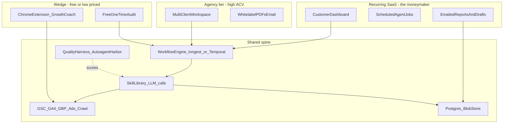

# SMB Marketing AI — distribution-led, agent-native (v2)

> Supersedes v1 ("SEO SaaS agent hub"). v1's section is preserved at the bottom for diff context.

## What changed since v1

v1 was technology-led ("which repo is the trunk?"). For an SMB SEO/marketing SaaS that is the wrong starting question. Four anchor errors fixed here:

1. v1 picked [SPRYTE1.0](https://github.com/sentientsprite/SPRYTE1.0) / OpenClaw as the trunk because it has the most code. But OpenClaw is a **personal-assistant gateway** built around inbound DMs (WhatsApp, Telegram, iMessage, Discord) with pairing-based security. SMB buyers do not want to DM a bot — they want a dashboard, a scheduled report in their inbox, and proof that rankings/leads moved.
2. v1 assumed "team of agents" = agent runtime. For SMB SEO work, **~80% of the value is deterministic** (GSC API → rank deltas → opportunity list). LLM agents add narrative, prioritization, and content drafts on top. Building on a heavy agent gateway over-engineers the thin LLM layer.
3. v1 underweighted **distribution**. Landscapers and handymen do not browse SaaS catalogs. They buy when (a) someone they trust shows them money left on the table, or (b) a tool they already use surfaces it.
4. v1 treated the local [autoagent](README.md) workspace as an afterthought. It is the only piece of the existing stack that can prove agents get **measurably better over time** — that is the moat for an SEO product where output quality is the entire pitch.

---

## What you have, re-scored under the new lens

| Repo | Role under v1 | Role under v2 |
|---|---|---|
| [SPRYTE1.0](https://github.com/sentientsprite/SPRYTE1.0) | Canonical trunk | Source of borrowed parts (browser tool, `DGTL-MKTG-ASST` rule engine). Personal R&D + later optional messaging side-channel for Pro/Agency tiers. |
| [nemo-workspace](https://github.com/sentientsprite/nemo-workspace) | Per-tenant template | Pattern to copy server-side: per-tenant `AGENTS.md` / `MEMORY.md` playbook stored in DB + blob, fed into LLM context. |
| [DGTL-MKTG-ASST-main](https://github.com/sentientsprite/SPRYTE1.0/tree/main/DGTL-MKTG-ASST-main) | One of two extensions to merge | Rewire as a **thin client** to the SaaS backend (auth + insights server-side). Centralizes prompts, models, billing, and observability. |
| [MKTG-Chrome-Extenstion](https://github.com/sentientsprite/MKTG-Chrome-Extenstion) | Merge candidate | Archive. |
| [nemo-agent](https://github.com/sentientsprite/nemo-agent) | Adjacent | Park (trading domain). |
| [openclaw](https://github.com/sentientsprite/openclaw) | Upstream fork | Leave as-is; not needed for SaaS. |
| [poly-bot-backup](https://github.com/sentientsprite/poly-bot-backup) | Adjacent | Leave. |
| [autoagent](README.md) (this workspace) | "Optional" Phase 5 | **Promote to SkillEval** — the regression scoring system for every SEO skill shipped. Release gate from day 1. |

---

## New mental model: three products, one spine

Three commercial surfaces, one shared spine. Ship the spine once and re-skin per ICP.

---

## Build vs. fork (reversed from v1)

Recommendation: **do not** fork OpenClaw/Nemo for the SaaS. Use it as a personal R&D harness and possibly as a messaging side-channel for power users later.

| Concern | OpenClaw fork (v1) | Greenfield slim stack (v2) |
|---|---|---|
| Multi-tenant isolation | DM-pairing model, single-user gateway, retrofit needed | Native from day 1 (`org_id` everywhere, Postgres RLS) |
| Compliance for client GA/GSC data | Personal-device model fights you | Standard SaaS patterns work |
| `pi-*` proprietary dep risk | Already flagged in `INDEPENDENCE-PLAN.md` | Avoided entirely |
| Time to first paying customer | Months | Weeks |
| Channels actually needed for SMB | Web + email + extension | Web + email + extension |

What to **borrow** from existing repos rather than fork:
- The **`DGTL-MKTG-ASST` rule engine** (traffic drop, paid waste, SEO opportunity heuristics) — port to the backend as v0 of the recommendation engine before swapping in LLM-generated narratives.
- The **nemo-workspace markdown pattern** (`AGENTS.md`, `MEMORY.md`, `SOUL.md`) — generate one bundle per tenant, store in Postgres + blob, pass into LLM context for the narrative skills.
- The **Nemo browser tool / Playwright wiring** — wrap as a single internal `site_crawl` service.

---

## The actual agents (concrete, not vague)

Each skill = (1) input schema, (2) tool allowlist, (3) deterministic-vs-LLM split, (4) verifier in the Harbor harness.

| Skill | Deterministic part (always runs) | LLM part (narrative/drafts) | Verifier scoreable in autoagent? |
|---|---|---|---|
| `local_visibility_audit` | GBP API completeness check, NAP scrape across N directories, review velocity calc | Prioritized fix list, plain-English summary | Yes — gold-standard fix list per fixture site |
| `gsc_opportunity_finder` | 90 days of GSC, queries in pos 4–15 with high impressions, page-query dedupe | Title/H1 rewrite suggestions per page | Yes — % of true high-opportunity queries surfaced |
| `ga4_health_brief` | Trend deltas, channel mix, conversion path | Monthly client narrative | Partial — narrative judged by rubric |
| `local_landing_builder` | Service × city matrix, internal-link plan | Drafts service-area pages with schema markup | Yes — schema validity, uniqueness, keyword coverage |
| `paid_qa` (phase 2) | Search-term waste, geo overlap, conversion attribution | Negative-keyword and pause recommendations | Yes — % of known-bad terms flagged |
| `reputation_loop` | Review velocity by source, sentiment | Reply drafts, ask-for-review SMS templates | Partial |
| `competitor_pulse` (phase 3) | Detect new pages/keywords on N competitors via crawl | Threat/opportunity narrative | Yes |

**Crucial:** the supervisor is a **workflow, not an agent**. A workflow engine (Inngest, Temporal, Trigger.dev, or a thin Postgres-backed queue) calls skills in order, passes structured JSON between them, and writes artifacts. The "agent" only lives inside each skill where reasoning is actually needed. This avoids the well-known failure mode where an LLM "supervisor" loses determinism and SLAs.

---

## ICP positioning (sharper than v1)

**Home services (landscapers, handymen, HVAC, plumbers, cleaners) — recommended lead ICP**
- Pain: GBP is their #1 lead channel and they barely touch it.
- Wedge: free 5-minute "Local Visibility Score" — public landing page, takes business name + zip, returns a graded report.
- Core SKU: $99–$199/mo "Local Autopilot" — weekly GBP post, monthly fresh service-area page, review-request SMS templates, monthly report.
- Sales motion: trade associations + route-based service software (Jobber, Housecall Pro, ServiceTitan) integrations — they have the customers; you have the marketing layer.

**Growing online businesses (e-com, SaaS, info-product, local chains)**
- Pain: GA4/GSC data they never look at; agency retainers $3–8k/mo.
- Wedge: Chrome extension that lights up inside their GA/GSC tab with prioritized actions.
- Core SKU: $299–$799/mo "Growth Operator" — weekly GSC opportunity report, content briefs, paid waste alerts, monthly narrative.
- Sales motion: content-led + the extension as a viral surface (every screenshot in the wild advertises the product).

**Agencies (phase 3, high ACV)**
- Pain: junior analysts spend 60% of their time pulling the same reports.
- Core SKU: $499–$2,000/mo per seat or per N clients, white-label PDFs, multi-client workspace, REST API.

---

## Reordered phases (distribution-first)

**Phase 0 — Pick one ICP and one wedge (1 week, mostly decisions)**
- Recommend home services + free Local Visibility Score landing + paid Local Autopilot. Faster validation, less competition than e-com SEO tooling.
- Decide: keep "Nemo" branding (B2B-neutral) or stand up a new brand.

**Phase 1 — Wedge that captures emails (2–3 weeks)**
- Single Next.js app on Vercel + Supabase.
- Public form → backend runs `local_visibility_audit` synchronously → emails PDF + saves lead.
- No login, no Stripe yet. Goal: 100 audits run, 10 conversations.

**Phase 2 — Recurring SaaS MVP (3–5 weeks)**
- Add Supabase auth + Stripe + a workflow engine (Inngest is the lowest-friction).
- Implement `gsc_opportunity_finder` and `ga4_health_brief` behind Google OAuth.
- Tenant model: org → sites → connectors → scheduled jobs.
- Per-tenant playbook stored as the nemo-workspace markdown bundle in object storage; passed into LLM context for narrative skills.

**Phase 3 — Chrome extension reborn**
- Take `DGTL-MKTG-ASST-main` and rewire it to authenticate against the SaaS backend (not Google directly), so the extension is a thin client that calls server skills.
- Retire `MKTG-Chrome-Extenstion`.

**Phase 4 — Quality harness on top of `autoagent`**
- Underrated multiplier. For each skill, write 5–20 Harbor tasks with verifiers using the pattern in [`README.md`](README.md). Examples:
  - "Given this GSC export fixture, output JSON must include these 7 query opportunities."
  - "Given this GBP profile, output must flag the missing service area."
- Run nightly. The score per skill becomes a release gate. Most "ChatGPT for SEO" tools have no quality regression suite — this is a wedge against them.

**Phase 5 — Agency tier and integrations**
- Multi-client workspace, white-label, REST API.
- Integrations with Jobber/Housecall Pro/ServiceTitan (home services) and HubSpot/Shopify (growing online).

**Phase 6 — Optional: messaging gateway as a feature**
- For Pro/Agency tiers, expose Nemo/OpenClaw as a side-channel: "DM your marketing AI." This is where existing OpenClaw work pays off — as a feature, not the core.

---

## Concrete tech stack (opinionated)

- **Frontend + API:** Next.js (App Router) on Vercel. tRPC or Hono for the API.
- **DB + auth + storage:** Supabase (Postgres, RLS for multi-tenancy, auth, blob storage for PDFs).
- **Workflow:** Inngest (serverless, durable, retries, schedules — replaces "cron in Nemo").
- **LLM:** Vercel AI SDK or direct provider SDKs; OpenRouter behind a feature flag for failover. No `pi-*` lock-in.
- **Connectors:** Google APIs (GSC, GA4, GBP, Ads), Meta Marketing API (phase 2). Encrypted refresh tokens in Supabase, per-tenant envelope encryption.
- **Crawler/browser:** Playwright in a containerized worker (Fly.io or Railway) — liftable from Nemo's browser routes.
- **Eval/quality:** the existing `autoagent` Harbor harness in this workspace, with SEO-specific task packs added under [`tasks/`](README.md).
- **Observability:** Logfire or Sentry + structured logs.
- **Billing:** Stripe.

---

## Risks (refreshed)

- **LLM hallucinated SEO advice** is the #1 product-killer in this category. Mitigation: every recommendation is generated from structured data slots, not free-form "what should I do for SEO?" prompts. The Harbor verifiers exist to catch drift.
- **Google API quotas + OAuth verification** take real calendar time (security review, brand verification). Start the OAuth verification process the day the wedge ships.
- **Local-SMB churn**: solo operators churn fast. Mitigation: anchor in *outcomes they see in their inbox without logging in* (monthly PDF + an SMS "we did X this month").
- **Build trap**: do not build a custom agent gateway. One already exists (Nemo) and the SaaS does not need it.

---

## First five concrete moves (when execution starts)

1. Confirm ICP pick (home services first vs growing-online first).
2. Scaffold Next.js + Supabase + Inngest project under a new directory or repo.
3. Implement `local_visibility_audit` end-to-end (deterministic + LLM narrative) and ship the public wedge page.
4. Add 10 Harbor tasks under [`tasks/`](README.md) in this workspace that score that skill, so quality is a number from day 1.
5. Wire Stripe + auth + the second skill (`gsc_opportunity_finder`) for the first paid SKU.

---

# Appendix A — v1 (preserved for diff context)

> Original "SEO SaaS agent hub" plan. Superseded by the body above. Kept so the rationale for each reversal is auditable.

## v1: What you already have (evidence-based)

Your [GitHub profile](https://github.com/sentientsprite) clusters into three layers:

1. **Agent runtime (TypeScript monorepo)** — [SPRYTE1.0](https://github.com/sentientsprite/SPRYTE1.0) documents a **Spryte Engine** forked from OpenClaw (the engine name in that repo's README is the historical brand; v2 productization rebrands forward to Nemo): gateway (HTTP/WebSocket), agents and tools (`exec`, browser, cron, memory, sessions), channels, sessions, plugins, and vector memory over markdown ([`ARCHITECTURE.md`](https://raw.githubusercontent.com/sentientsprite/SPRYTE1.0/main/ARCHITECTURE.md)). v1 framed this as the natural central nervous system for "a team of agents". v2 reverses: it is a personal-assistant gateway, wrong abstraction for B2B SaaS.
2. **Operator / brand layer** — [nemo-workspace](https://github.com/sentientsprite/nemo-workspace) (`AGENTS.md`, `SOUL.md`, `MEMORY.md`, `TOKEN-EFFICIENCY.md`, `dashboard/`, `memory/`, `references/`). v2 keeps the *pattern*, drops the *deployment shape*.
3. **Marketing surface area** — [`DGTL-MKTG-ASST-main/`](https://github.com/sentientsprite/SPRYTE1.0/tree/main/DGTL-MKTG-ASST-main) "AI Growth Coach" Chrome extension (GA4 OAuth, rule-based insights). [MKTG-Chrome-Extenstion](https://github.com/sentientsprite/MKTG-Chrome-Extenstion) is a parallel/older HTML track.
4. **Parallel / adjacent repos** — [nemo-agent](https://github.com/sentientsprite/nemo-agent) (trading), [openclaw](https://github.com/sentientsprite/openclaw) fork, [poly-bot-backup](https://github.com/sentientsprite/poly-bot-backup) (off-topic).
5. **Local workspace** — [autoagent](README.md) Harbor + OpenAI Agents SDK harness. v1 deferred to "Phase 5". v2 promotes to release-gate scorecard.

## v1: Strategic choice (reversed)

v1 picked SPRYTE1.0 as canonical trunk. v2 reverses: do not fork; borrow parts.

## v1: Phased delivery (reordered in v2)

v1 ordered: repo consolidation → control plane → orchestration → dashboard+extension → packaging → quality.
v2 reorders: pick ICP → wedge → recurring SaaS MVP → extension rewire → quality harness → agency → optional messaging gateway.

## v1: Deliverables

1. Architecture doc in trunk: "SaaS control plane + Nemo runtime boundaries."
2. Minimal multi-tenant API + job table + one end-to-end job (GSC).
3. One supervisor prompt + two skills (auditor + reporter).
4. Roadmap to unify Chrome extension and web app under one auth model.
